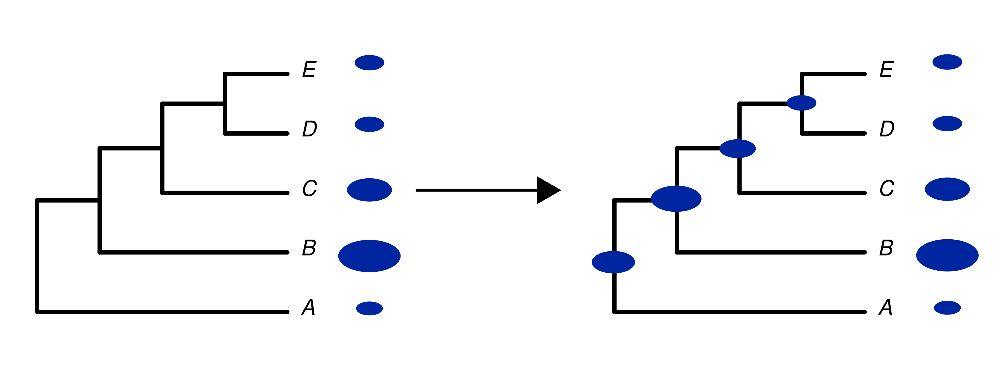
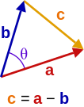

```{r setup, include=FALSE}
knitr::opts_chunk$set(echo = TRUE)
```

# Introdução

Primeiro alguns links:

- [Roteiro para elaboração da monografia final](http://diogro.github.io/BioEvol/roteiro.html)
- [Apostila da disciplina](https://github.com/lem-usp/apostila-bio-evol/blob/master/apostila-Bio312.pdf?raw=true)

## Genética quantitativa e evolução

Neste tutorial vamos passar por todas as etapas de análise de um conjunto de dados em genética quantitativa aplicada à macroevolução. Vamos estudar quatro caracteres quantitativos medidos em cinco espécies de roedores em uma filogenia conhecida. Usando esse conjunto de dados, vamos caracterizar o padrão de modularidade em cada espécie, as diferenças nas morfologias médias, e os processos evolutivos que levaram à diferenciação atual.

O primeiro passo, como sempre, é escolher um ambiente de análise. Neste tutorial vamos usar a linguem R, mas todos os passos poderiam ser feitos num programa gráfico como excel e Systat, ou em qualquer outra linguagem de programação, como python, perl, java, C ou Haskell. A linguagem R é especialmente conveniente, primeiro por que os monitores sabem usar ela, e segundo por que existe um pacote (escrito pelos monitores) que automatiza várias dos passos da análise.

## A linguagem R

R é um ambiente de programação _open source_ criado pensando em análises estátisticas. Você pode ler um pouco mais sobre a linguagem neste [site](http://ecologia.ib.usp.br/bie5782/doku.php?id=bie5782:03_apostila:01-intro}).

### Instalando o R

Se você está utilizando um dos computadores do IB, o R já deve estar instalado. Se não, siga as instruções nesse [site](https://mran.revolutionanalytics.com/download/) para instalar o R, e opcionalmente (mas muito recomendado!) o editor de código [RStudio](https://www.rstudio.com/products/rstudio/download/).

### Rodando comandos

Ao longo desse tutorial, você sempre vai ver blocos de código que devem ser executados no ambiente R. Por exemplo, se estivessemos interessados em somar dois números poderiamos digitar:

```{r sum}
1 + 1
```

E abaixo da operação temos o resultado que o programa retorna. 

Você pode também associar valores a variáveis (chamados objetos) e utilizar esses objetos nas suas operações. O operador "=" associa um valor a um objeto:

```{r objects}
x = 1
y = 2
x + y
```
  
## Seguindo o tutorial
  
Exitem dois jeitos de seguir esse tutorial: (1) cegamente copiar e colar os comandos no R ver o resultado; ou (2) entender o que cada parte do comando executado está fazendo e assim já aprender um pouco de R de brinde. Ambas são ok! Nosso objetivo aqui é a biologia evolutiva, o R é só um acessório. Quando alguma operação no R parecer mais esotérica, vamos tentar explicar nos comentários do código ou no texto. Se não ficar claro, consulte os monitores!

## Preliminares

Para começar, precisamos instalar um pacote (chamado evolqg) e carregar os dados para a area de trabalho usando a função data. Funções no R são como pequenos conjuntos de instruções com um nome. Para executar uma função basta digitar o nome dela, com os argumentos daquela função entre parênteses. Linhas que começam com # são comentários e são ignoradas pelo R. (Para ver mais exemplos iniciais, confira [esse tutorial](http://ecologia.ib.usp.br/bie5782/doku.php?id=bie5782:03_apostila:02-entrada) do curso de pós-graduação em R oferecido pela ecologia do IB!)

```{r packagesfake, eval = FALSE}
# Instalando o pacote de genética quantitativa evolutiva
if(!require){install.packages("evolqg")}

# Carregando o pacote evolqg
library(evolqg)

# Carregando o conjunto de dados que vamos utilizar
data(dentus)
```
```{r packages, echo = FALSE}
library(evolqg)
data(dentus)
```

## Aos dados!

Com os dados carregados, podemos ver todas as medidas digitando o nome do objeto com os dados. 

Aqui vamos ver só as primeiras linhas, mas no seu computador você deve ver o conjunto completo.

```{r fake, eval = FALSE}
dentus
```
```{r dados, echo = FALSE}
head(dentus)
```

Como podemos ver, os dados estão organizados em linhas e colunas. Cada linha representa um indivíduo, e cada coluna representa um caráter. As 4 primeiras colunas são os caracteres quantitativos, e a quinta coluna contém a espécie de cada indivíduo.

Essa mesma planilha está disponível nesse [link](https://raw.githubusercontent.com/diogro/BioEvol/master/dentus2016.csv).

# Objetivos da Aula 1

Em cada aula vamos fazer algumas contas e discutir os resultados. Ao final do curso todos esses resultados devem ser compilado num relatório final.

Nessa aula vamos calcular:

1. Média de cada caráter;
2. Variância de cada caráter;
3. Coeficiente de variação de cada caráter;
2. Gráfico da distribuição de cada caráter.

## Médias e variâncias globais

Vamos começar calculando as médias globais utilizando a função sapply e a função mean. 

Os resultados não aparecem aqui, mas rodando os comandos no R você deve ser capaz de produzí-los!

```{r, eval = FALSE}
# Como a última coluna contém as espécie, 
# vamos utilizar o operador de indexação do R  [] para selecionar as colunas de 1 a 4.
# A função sapply passa todas as colunas do primeiro argumento para a função no segundo argumento. 
sapply(dentus[,1:4], mean)
```

Podemos utilizar a mesma estratégia para calcular as variâncias e desvios padrões:

```{r, eval = FALSE}
# Variâncias
sapply(dentus[,1:4], var)

# Desvios padrão
sapply(dentus[,1:4], sd)
```

Para calcular o coeficiente de variação, podemos dividir diretamente o desvio padrão pela média:

```{r, eval = FALSE}
# Objeto com os desvios padrão
dentus_sd = sapply(dentus[,1:4], sd)

# Objeto com as médias
dentus_mean = sapply(dentus[,1:4], mean)

# Cálculo do coeficiente de variação
dentus_sd/dentus_mean
```

Ou podemos criar uma função que calcula o coeficiente de variação diretamente

```{r, eval = FALSE}
# Função que calcula o coeficiente de variação
cv = function(x) sd(x)/mean(x)

# Coeficiente de variação
sapply(dentus[,1:4], cv)
```

## Médias e variâncias por espécie

Agora vamos tentar obter esses mesmos valores separando os dados pos espécie. A função aggregate vai ajudar. Essa função é muito semelhante à sapply, mas ela recebe um argumento adicional que permite utilizar uma coluna dos dados para separar os individuos em grupos. Por exemplo, para calcular a média por espécie fazemos:

```{r}
aggregate(dentus[,1:4], list(especie = dentus[,5]), mean)
```

Vc consegue seguir essa lógica e calcular as variâncias e coeficientes de variação por espécie?

## Gráficos

É sempre importantissimo visualisar os dados usando gráficos antes de fazer qualquer análise mais complexa. Vamos explorar várias possibilidades de gráficos que revelam aspectos diferentes da distribuição dos nossos dados. 

Para isso vamos carregar alguns pacotes gráficos:

### Carregando pacotes gráficos

```{r, eval = FALSE}
list_pkgs <- c("ggplot2", "GGally", "reshape2")
new_pkgs <- list_pkgs[!(list_pkgs %in% installed.packages()[,"Package"])]
if(length(new_pkgs) > 0){ install.packages(new_pkgs) }

library(evolqg)
library(ggplot2)
library(GGally)
library(reshape2)
```

### Gráficos univariados

O primeiro e mais simples talvez seja o histograma.

```{r, eval = FALSE}
ggplot(melt(dentus), aes(value, group = species, fill = species)) + 
  geom_histogram() + 
  facet_wrap(~variable, scale = "free")
```

Podemos também usar boxplots:

```{r, eval = FALSE}
ggplot(melt(dentus), aes(species, value, fill = species, group = interaction(species, variable))) + 
  geom_boxplot() + 
  facet_wrap(~variable, scale = "free")
```

Ou um chiquérrimo violin plot:

```{r, eval = FALSE}
ggplot(melt(dentus), aes(species, value, fill = species, group = interaction(species, variable))) + 
  geom_violin() + 
  facet_wrap(~variable, scale = "free")
```

### Gráficos bivariados

Outro aspecto interessante é a relação par a par das variáveis.

Por exemplo, vamos olhar para a distribuição bivariada dos dois primeiros caracteres, incluindo também uma reta de regressão por espécie:

```{r, eval = FALSE}
ggplot(dentus, aes(humerus, ulna, group = species, color = species)) + 
  geom_point() +
  geom_smooth(method = "lm", aes(group = species))
```

Vc poderia fazer esse gráfico manualmente para todos os pares de caracteres, mas a função ggpairs resume tudo isso de uma vez:

```{r, eval = FALSE}
ggpairs(dentus, mapping = aes(color = species), 
        columns = c("humerus", "ulna","femur", "tibia"))
```

# Leitura da Aula 2

- [The Ecological Significance of Correlation Pleiades](https://www.jstor.org/stable/2405824) ([pdf](https://github.com/lem-usp/site-bio208/raw/master/static/pdfs/artigos/Berg-1960.pdf))

    __Abstract:__
    The phenomenon of correlation pleiades, i.e., the presence of correlations between some quantitative characteristics of certain parts of an organism and at the same time by the absence of correlations between these and the other parts demonstrates the independence of certain developmental processes with respect to other processes within the organism. The study of correlation sets makes it possible to establish the degree of such independence. The adoption of a quantitative criterion provides an adequate basis for the comparative method in the study of stabilizing selection. Nineteen species of herbaceous plants have been studied in order to determine the variability in the degree of dependence between the dimensions of different parts of an organism. It has been established that twelve species have correlation pleiades, while seven species have no correlation pleiades with respect to the dimensions of analogous parts. In all the instances of existence of pleiades it was the flower that had become free of the correlation interdependences within the plant organism. Existence of correlation pleiades is associated with the mode of pollen transfer, involving the presence of specific insect pollinators, with adaptations to localize the pollen deposit on some definite part of the body of the pollinating insect, and with at least one of the structural features providing for such localization (zygomorphism, presence of tubular parts, lateral position of flowers, oligomerization and a rigid fixation of the number of homologous parts of a flower). Insects were the selective factor stabilizing the dimensions of those parts of flowers which participate in the process of the precise localization of pollen on the insect body. Stabilizing selection of flower dimensions created correlation pleiades for reproductive organs, as well as for vegetative parts of the same organism. The general principle underlying the origin of developmental homeostasis in the process of evolution is the discrepancy between the agencies participating in the formation of the character and the selective forces determining its function. The same principle is responsible for the origin of correlation pleiades.

# Objetivos da Aula 2

Nessa aula vamos explorar a associação presente entre os caracteres fenotípicos nas nossas populações.
Com isso vamos poder discutir questões ligadas a função, desenvolvimento e a interação das populações com a seleção natural.

Para isso, vamos calcular:

 1. A matriz de covariância fenotípica total;
 2. A matriz de covariância fenotípica pode espécie;
 3. A matriz de correlação por espécie;

Além disso, discuta:

 1. Qual o padrão modular de cada espécie? 
 2. Qual é a intensidade da associação entre os caractéres em cada espécie?
 
## Covariâncias e correlações

Para entender como a associação entre os caracteres muda entre espécies, é preciso quantifica-lá. Para isso, vamos utilizar os conceitos de covariância e correlação. A covariância entre duas variáveis é definida como a média do produto dos desvios das médias das variáveis. Ou seja, se $\overline x$ e $\overline y$ são as médias dos caracteres $x$ e $y$, a covariâncias entre eles numa população é:

$$
Cov(x, y) = \frac{1}{N} \sum_{i = 1}^{N} (x_i - \overline{x})(y_i - \overline y)
$$

Para que possamos entender essa formula intuitivamente, vamos pensar nos sinais de cada termo da soma. Em que condições o termo $(x_i - \overline{x})(y_i - \overline y)$ é positivo e contribui pra aumentar a covariância? E quando ele é negativo? Como esse termo é um produto de desvios, o produto vai ser positivo quando os dois desvios tiverem o mesmo sinal, e negativo quando os desvios tiverem sinais diferentes. Ou seja: quando tanto o caráter $x$  quando o $y$ estiverem acima ou abaixo das suas médias, o produto é positivo e contribui pra aumentar a covariância; quando $x$ é menor do que a média e $y$ é maior, ou vice-versa, o produto é negativo e contribui para diminuir a covariância. Se, ainda, os desvios não tiverem relação nenhuma, desvios na mesma direção e em direções opostas tendem a se cancelar, e a covariação será
próxima de zero. Isso está ilustrado na figura abaixo, indivíduos nas regiões em azul aumentam a covariância, enquanto indivíduos na região em amarelo diminuem a covariância.

```{r, echo = FALSE, warning=FALSE, message=FALSE }
set.seed(42)
library(ggplot2)
library(mvtnorm)
data = data.frame(rmvnorm(50, sigma = 0.8*matrix(c(1, 0.7, 0.7, 1), 2)))
ggplot(data, aes(X1, X2)) + 
   annotate("rect", xmin = Inf, xmax = 0, ymin = Inf, ymax = 0, fill= "blue", alpha = 0.5)  + 
   annotate("rect", xmin = -Inf, xmax = 0, ymin = -Inf, ymax = 0 , fill= "blue", alpha = 0.5) + 
   annotate("rect", xmin = 0, xmax = Inf, ymin = 0, ymax = -Inf, fill= "yellow", alpha = 0.5) + 
   annotate("rect", xmin = 0, xmax = -Inf, ymin = Inf, ymax = 0, fill= "yellow", alpha = 0.5) + 
   geom_point() + theme_classic() + xlim(-2,2)+ ylim(-2,2) + labs(x = "x", y = "y")
```

As covariâncias entre caracteres são quantidades muito importantes na biologia evolutiva, como vamos ver mais adiante no curso. Apesar disso, elas sofrem do mesmo problema das variâncias: dependem da escala absoluta dos caracteres sendo medidos. Assim, não podemos comparar covariâncias entre pares de caracteres que tenham escalas diferentes, e não podemos comparar as covariâncias entre os mesmo caracteres medidos em organismos que tenham escalas diferentes. Para isso, vamos definir uma segunda medida de associação que e admensional, e que pode ser comparada entre escalas: a correlação linear. Note que se medirmos a covariância de um caráter com ele mesmo, chegamos na formula da variância. A partir disso, é fácil mostrar que o valor mais alto que uma covariância pode assumir é o produto dos desvios padrão entre as variâveis medidas (afinal, a covariância máxima de um caráter é com ele mesmo, ou seja, sua variância, que é o desvio padrão ao quadrado). Então, vamos definir a correlação como a proporção da covariância máxima entre dois caracteres, ou a covariância dividido pelo produto dos desvios padrão: 

$$
Cor(x, y) = \frac{Cov(x, y)}{\sigma_x \sigma_y} = \frac{1}{N} \sum_{i = 1}^{N} \frac{(x_i - \overline{x})(y_i - \overline y)}{\sigma_x \sigma_y}
$$

Essa quantidade varia entre -1 e 1, e mede o grau de associação entre duas variáveis numa escala absoluta. Correlações próximas de 1 indicam que os caracteres variam juntos e na mesma direção; correlações próximas de -1 indicam que os caracteres variam juntos mas em direções opostas; correlações próximas de zero indicam que os caracteres são independentes. A correlação pode ser comparada entre caracteres e populações diferentes. 

## Medindo covariâncias e correlações no R

Primeiro vamos carregar os dados novamente:

```{r}
# Carregando o pacote evolqg
if(!require(evolqg)){install.packages("evolqg"); library(evolqg)}
data(dentus)
```

Agora vamos utilizar a função cov para calcular a covariância entre um par de caracteres:

```{r}
cov(dentus$humerus, dentus$ulna)
```

__Pergunta__: Esse valor de covariância é alto ou baixo? 

__Resposta__: Não faço a mais parva ideia! A covariância depende da escala! Vamos olhar para a correlação (usando a função cor), que tem escala absoluta.

```{r}
cor(dentus$humerus, dentus$ulna)
```

Esse é um valor próximo de 1, indicando alta associação entre as duas variáveis. Podemos ver isso num gráfico bivariado:

```{r, warning=FALSE, message=FALSE }
set.seed(42)
library(ggplot2)
library(mvtnorm)
ggplot(dentus, aes(humerus, ulna)) + 
   annotate("rect", xmin = Inf, xmax = mean(dentus$humerus), 
            ymin = Inf, ymax = mean(dentus$ulna), fill= "blue", alpha = 0.5)  + 
   annotate("rect", xmin = -Inf, xmax = mean(dentus$humerus), 
            ymin = -Inf, ymax = mean(dentus$ulna) , fill= "blue", alpha = 0.5) + 
   annotate("rect", xmin = mean(dentus$humerus), xmax = Inf, 
            ymin = mean(dentus$ulna), ymax = -Inf, fill= "yellow", alpha = 0.5) + 
   annotate("rect", xmin = mean(dentus$humerus), xmax = -Inf, 
            ymin = Inf, ymax = mean(dentus$ulna), fill= "yellow", alpha = 0.5) + 
   geom_point() + theme_classic()
```

A grande maioria dos pontos fica na região azul.

## Medindo várias covariâncias no R

Para que possamos comparar e interpretar a covariância ou correlação entre vários pares de caracteres simultaneamente, vamos utilizar uma notação matricial. Numa matriz de variância-covariância (ou simplesmente matriz de covariância), podemos representar todos os caracteres nas linhas e colunas, e assim, para saber a covariância entre um par de caracteres basta consultar a linha correspondente ao primeiro caráter na coluna correspondente ao segundo caráter. Para um conjunto de $p$ caracteres $\{z_1, z_2, ..., z_p\}$, podemos excrever sua matriz de covariância como:

$$
\begin{matrix}
Var(z_1) & Cov(z_1, z_2) & \cdots & Cov(z_1, z_p) \\
Cov(z_1, z_2) & Var(z_2) & \cdots & Cov(z_2, z_p) \\
\vdots & \vdots  & \ddots & \vdots                \\
Cov(z_1, z_p) & Cov(z_1, z_p) & \cdots & Var(z_p) \\
\end{matrix}
$$

No R, basta chamar a função cov num objeto com mais de uma coluna:

```{r}
cov(dentus[,1:4])
```

Essa é a matriz de covariância total (sem separação por espécie) dos nossos dados. Onde está o valor de covariância entre humero e ulna que calculamos antes? Esse valor aparece quantas vezes na matriz? Por que? Você consegue calcular agora a matriz de correlação total? Tem um jeito fácil (função cor), um médio (função cov2cor), e um difícil (na unha)!

## Medindo covariâncias de cada espécie

Agora vamos medir as covariâncias e correlações dentro de cada espécie. Para isso, vamos aprender a escolher apenas algumas linhas de uma tabela de dados no R. Suponha que eu queira ver apenas as linhas que sejam da espécie A. Posso fazer isso com o comando:

```{r, eval = FALSE}
dentus[ dentus$species == "A", ]
```

Podemos agora usar esse conjunto de dados reduzido para calcular a matriz da espécie A, e armazenar a matriz num objeto chamado cov_A:

```{r}
(cov_A = cov(dentus[ dentus$species == "A", 1:4]))
```

Siga essa mesma lógica e crie objetos para as matrizes de covariância e correlação de todas as espécies.

## Visualizando correlações

Podemos utilizar as matrizes de correlação para fazer representações gráficas da relação entre os pares de caracteres. Vamos escrever uma função (admito que meio complicada) que faça isso:

```{r, message=FALSE}
library(ggplot2)
library(reshape2)
if(!require(viridis)) install.packages("viridis")
library(viridis)
plotMatrix <- function (corMat, file = NULL) {
  diag(corMat) <- NA
  n_traits = nrow(corMat) 
  myPalette <- viridis(50)
  ## Se quiser uma paleta All American, use essa linha em vez da anterior
  #myPalette <- colorRampPalette(c("blue", "white", "red"))(n = 50)
  m.rs = melt(corMat) 
  m.rs$Var1 <- factor(m.rs$Var1, levels = m.rs$Var1[n_traits:1])
  m.rs.position = m.rs
  m.rs.position$Var1 <- as.numeric(m.rs.position$Var1)
  m.rs.position$Var2 <- as.numeric(m.rs.position$Var2)
  m.rs.position$value= round(m.rs.position$value, 2)
  m.rs.position$value[is.na(m.rs.position$value)] <- levels(m.rs$Var1)[n_traits:1]
  p <- 
    ggplot (m.rs) +
    geom_tile(aes(x = Var2, y = Var1, fill = value)) +
    scale_fill_gradientn(name = '', colours = myPalette, limits = c(-0.15, 1)) +
    labs(x = NULL, y = NULL) + 
    geom_text(data = m.rs.position, aes(x = Var2, y = Var1, label = value)) + 
    theme_bw()
  if(!is.null(file)) cowplot::save_plot(plot = p, file)
  return(p)
}
```

Agora podemos usar essa função para plotar a matriz de correlação de uma das espécies:

```{r}
cor_A = cor(dentus[ dentus$species == "A", 1:4])
plotMatrix(cor_A)
```

Olhe para todas as matrizes de correlação. Quais são os padrões modulares? Como esses padrões diferem entre as espécies? 

# Leitura da Aula 3

- [Adaptive Radiation Along Genetic Lines of Least Resistance](https://www.jstor.org/stable/2410734) ([pdf](https://github.com/lem-usp/site-bio208/raw/master/static/pdfs/artigos/Schluter%20-%201996%20-%20Adaptive%20Radiation%20Along%20Genetic%20Lines%20of%20Least%20Resistance.pdf))

    __Abstract:__
    Are measurements of quantitative genetic variation useful for predicting long-term adaptive evolution? To answer this question, I focus on gmax, the multivariate direction of greatest additive genetic variance within populations. Original data on threespine sticklebacks, together with published genetic measurements from other vertebrates, show that morphological differentiation between species has been biased in the direction of gmax for at least four million years, despite evidence that natural selection is the cause of differentiation. This bias toward the direction of evolution tends to decay with time. Rate of morphological divergence between species is inversely proportional to θ, the angle between the direction of divergence and the direction of greatest genetic variation. The direction of greatest phenotypic variance is not identical with gmax, but for these data is nearly as successful at predicting the direction of species divergence. I interpret the findings to mean that genetic variances and covariances constrain adaptive change in quantitative traits for reasonably long spans of time. An alternative hypothesis, however, cannot be ruled out: that morphological differentiation is biased in the direction gmax because divergence and gmax are both shaped by the same natural selection pressures. Either way, the results reveal that adaptive differentiation occurs principally along "genetic lines of least resistance."

# Objetivos da Aula 3

- Calcular os componentes principais de cada espécie

## Componentes principais

A tecnica de componentes princiais (também conhecida como principal component analysis ou PCA) consiste em encontrar eixos ortogonais (com angulo de 90 graus entre eles) nos quais as variáveis medidas são não correlacionadas. Em outras palavras, nós descrevemos os individuos das nossas populações usando eixos relacionados às medidas tomadas em cada individuo, então um eixo corresponde ao comprimento do humero, outro eixo ao comprimento da ulna e assim por diante. Mas nesses eixos, que tem uma interpretação biológica clara, as medidas dos individuos em cada eixo são correlacionadas. 

### Mudando os eixos

A analise de componentes principais consiste em encontrar eixos, criados a partir dos eixos originais, nos quais os individuos não são correlacionados. Antes de chegar nos componentes principais, vamos entender o que significa mudar os dados de eixos. Podemos ter, por exemplo, um eixo definido como uma combinação entre humero e ulna, e outro eixo correspondente à diferença entre humero e ulna. Vamos visualizar isso graficamente em duas dimensões, primeiro representando nos eixos originais as medidas de humero e ulna da espécie A. Vamos centralizar as medidas no zero para facilitar o gráfico, de modo que os valores nos eixos x e y vão ser diferenças das médias:

```{r, warning=FALSE, message=FALSE }
if(!require(evolqg)){install.packages("evolqg"); library(evolqg)}
data(dentus)

library(ggplot2)
# Separando e centralizando os dados da espécie A
dentus_A = as.data.frame(scale(dentus[dentus$species == "A",1:4], scale = FALSE))

# Plot de humero por ulna. Note que as duas medidas são correlacionadas 
cor(dentus$humerus, dentus$ulna)
ggplot(dentus_A, aes(humerus, ulna)) + geom_point() + coord_fixed() + theme_bw()
```

Vamos agora incluir esses dois novos eixos hipotéticos, um na direção de aumento de humero e ulna (em azul), e um na direção de aumento de humero e diminuição de ulna (em vermelho). 

```{r, warning=FALSE, message=FALSE }
ggplot(dentus_A, aes(humerus, ulna)) + geom_point() + coord_fixed() + geom_abline(intercept = 0, slope = 1, color = "blue", linetype = "dashed") + geom_abline(intercept = 0, slope = -1, color = "red", linetype = "dashed") + geom_segment(x = 0, y = 0, xend = 1, yend = 1, arrow = arrow(length = unit(0.03, "npc")), color = "blue") + geom_segment(x = 0, y = 0, xend = 1, yend = -1, arrow = arrow(length = unit(0.03, "npc")), color = "red") + theme_bw()
```

Podemos calcular as medidas de cada inviduo (scores) nesses novos eixos projetando os pontos. Para isso, temos que achar o ponto nas retas coloridas que seja o mais próximo do ponto a ser projetado. Isso envolve um pouco de trigonometria, mas vamos usar essa função que encontra o ponto numa reta mais próximo de um ponto qualquer. Eu mantive o código aqui a titulo de curiosidade, não precisam se preocupar com ele:

```{r}
# A reta é definida pelos pontos p_0 e p_1, e o ponto fora da reta é o q
pontoMaisProximo <- function(q, p_0, p_1){
  A = matrix(c(p_1[1] - p_0[1], p_1[2] - p_0[2],
               p_0[2] - p_1[2], p_1[1] - p_0[1]), byrow = TRUE, ncol = 2)
  b = -1*c(-1*  q[1]*(p_1[1] - p_0[1]) -   q[2]*(p_1[2] - p_0[2]),
           -1*p_0[2]*(p_1[1] - p_0[1]) + p_0[1]*(p_1[2] - p_0[2]))
  return(c(q, solve(A, b)))
}
projecoes_blue = data.frame(t(apply(dentus_A[,1:2], 1, pontoMaisProximo, c(0, 0), c(1, 1))))
names(projecoes_blue) = c("x1", "y1", "x2", "y2")
projecoes_red = data.frame(t(apply(dentus_A[,1:2], 1, pontoMaisProximo, c(0, 0), c(1, -1))))
names(projecoes_red) = c("x1", "y1", "x2", "y2")
ggplot(dentus_A, aes(humerus, ulna)) + geom_point() + coord_fixed() +
  geom_abline(intercept = 0, slope = 1, color = "blue", linetype = "dashed") + 
  geom_abline(intercept = 0, slope = -1, color = "red", linetype = "dashed") + 
  geom_segment(x = 0, y = 0, xend = 1, yend = 1, arrow = arrow(length = unit(0.03, "npc")), color = "blue") + 
  geom_segment(x = 0, y = 0, xend = 1, yend = -1, arrow = arrow(length = unit(0.03, "npc")), color = "red") + 
  geom_segment(data = projecoes_blue, aes(x = x1, xend = x2, y = y1, yend = y2), linetype = "dotted", color = "blue") + 
  geom_segment(data = projecoes_red, aes(x = x1, xend = x2, y = y1, yend = y2), linetype = "dotted", color = "red") + theme_bw()
```

Nós podemos também rotacionar o dados, e plotar cada individuo como se os novos eixos "compostos", o azul e o vermelho, fossem os eixos x e y:

```{r}
# Rotacionando os dados usando uma matriz de rotação
dentus_A_rot = data.frame(as.matrix(dentus_A[,1:2]) %*% matrix(c(1/sqrt(2), 1/sqrt(2), 
                                                                 1/sqrt(2), -1/sqrt(2)), 2, 2))
names(dentus_A_rot) = c("x", "y")
ggplot(dentus_A_rot, aes(x, y)) + geom_point() + coord_fixed() + 
  geom_vline(xintercept = 0, color = "red", linetype = "dashed") + 
  geom_hline(yintercept = 0, color = "blue", linetype = "dashed") + 
  geom_segment(x = 0, y = 0, xend = 0, yend = 1, arrow = arrow(length = unit(0.03, "npc")), color = "red") + 
  geom_segment(x = 0, y = 0, xend = 1, yend = 0, arrow = arrow(length = unit(0.03, "npc")), color = "blue") +theme_bw()
```

Qual será a correlação dos dados nesses novos eixos?

```{r}
cor(dentus_A_rot$x, dentus_A_rot$y)
```

Ou seja, eles ainda são correlacionados. Qual seriam os eixos que deixam nossos dados não correlacionados?

### Meu primeiro PCA

A analise de componentes principais encontra esses eixos não correlacionados usando a matriz de covariância. Por enquanto, vamos continuar com apenas duas medidas (humero e ulna da especie A) e tentar encontrar os eixos onde essas duas medidas não são correlacionadas. Para isso, vamos encontrar a matriz de covariância entre essas duas medidas:

```{r}
# matriz de covariância entre humero e ulna
cov_hu = cov(dentus_A[,1:2])
cov_hu
```

Para encontrar os componentes principais, vamos usar a função eigen:

```{r}
# Vamos usar a função eigen na matriz de covariância cov_hu
PC_hu = eigen(cov_hu)
PC_hu
```

O objeto de saida da eigen, que eu chamei de PC_hu, tem duas partes: values e vectors. O vectors é uma matriz $2\times2$, e cada coluna corresponde a um PC. O número de PCs é sempre o mesmo que o numero de eixos originais, afinal, eu precisava de 2 eixos para descrever os dados e uma rotação não vai alterar isso. Então, o primeiro componente principal da matriz de covariância entre humero e ulna é:

```{r}
# Primeiro usamos o operador $ para pegar a matriz de PCs (vectors), 
# depois o operador [,1] para pegar a primeira coluna da matriz de PCs
PC_hu$vectors[,1]
```

Vamos colocar esses eixos no gráfico, como fizemos antes com os eixos azul e vermelho (vou manter o azul e o vermelho a titulo de comparação, até que nosso chute tinha sido bom!):

```{r, warning=FALSE, message=FALSE }
PC1 = PC_hu$vectors[,1]
PC2 = PC_hu$vectors[,2]

ggplot(dentus_A, aes(humerus, ulna)) + geom_point() + coord_fixed() + 
  geom_abline(intercept = 0, slope = 1, color = "blue", linetype = "dashed") + 
  geom_abline(intercept = 0, slope = -1, color = "red", linetype = "dashed") + 
  geom_segment(x = 0, y = 0, xend = PC1[1], yend = PC1[2], arrow = arrow(length = unit(0.03, "npc")), color = "green") + 
  geom_segment(x = 0, y = 0, xend = PC2[1], yend = PC2[2], arrow = arrow(length = unit(0.03, "npc")), color = "purple") + theme_bw()
```

Agora vamos rotacionar os dados para os eixos dados pelos PCs

```{r}
# Rotacionando os dados usando os PCs
dentus_A_rot_PCs = data.frame(as.matrix(dentus_A[,1:2]) %*% PC_hu$vectors)
names(dentus_A_rot_PCs) = c("x", "y")
ggplot(dentus_A_rot_PCs, aes(x, y)) + geom_point() + coord_fixed() + 
  geom_vline(xintercept = 0, color = "purple", linetype = "dashed") + 
  geom_hline(yintercept = 0, color = "green", linetype = "dashed") + 
  geom_segment(x = 0, y = 0, xend = 0, yend = 1, arrow = arrow(length = unit(0.03, "npc")), color = "purple") + 
  geom_segment(x = 0, y = 0, xend = 1, yend = 0, arrow = arrow(length = unit(0.03, "npc")), color = "green") +theme_bw()
```

E a correlação?

```{r}
round(cor(dentus_A_rot_PCs$x, dentus_A_rot_PCs$y), 8)
```


## PCA em todas as espécies

Agora vamos partir pra um exemplo de verdade e calcular os PCs dos nossos quatro caracteres para todas as espécies. Para isso, vamos calcular novamente nossas matrizes de covariância:

```{r}
# Vamos criar uma lista com todas as nossas matrizes de uma vez só:
cov_matrices = dlply(dentus, .(species), function(x) cov(x[,1:4]))

# Agora podemos acessar cada matriz individualmente colocando no final do nome da lista 
# o operador $ seguido do nome da especie
# Por exemplo, essa é a matriz de covariância da espécie A:
cov_matrices$A
```

Para encontrar os componentes principais, vamos usar a função eigen:

```{r}
PCs_A = eigen(cov_matrices$A)
PCs_A
```

Agora o vectors é uma matriz $4\times4$ (começamos com 4 eixos), e cada coluna corresponde a um PC. Então, o primeiro componente principal de A é:

```{r}
# Primeiro usamos o operador $ para pegar a matriz de PCs (vectors), 
# depois o operador [,1] para pegar a primeira coluna da matriz de PCs
PCs_A$vectors[,1]
```

Note como todos os elementos desse componente tem o mesmo sinal e magnitude parecida. Isso significa que ao longo da direção definida por esse eixo todas as medidas aumentam ou diminuem juntas. Componentes desse tipo são chamados de componentes de tamanho (size). 

Podemos olhar pra o segundo componente, que tem valores positivos para humero e ulna, e negativos para femur e tibia. Ou seja, é uma direção ao longo da qual humero e ulna aumentam enquanto femur e tibia diminuem. Esse tipo de componente é um contraste entre os dois grupos de caracteres.

## Values?

Para entender o que são os values no objeto de saida da eigen(), vamos projetar nossos dados nos PCs:

```{r}
# Rotacionando os dados usando os PCs
dentus_A_rot_PCs = as.matrix(dentus_A[,1:4]) %*% PCs_A$vectors

# Primeiras linhas dos dados rotacionados
head(dentus_A_rot_PCs)
```

Agora vamos calcular a matriz de covariância desses dados rotacionados:

```{r}
round(cov(dentus_A_rot_PCs), 10)
```
 Primeiro, note que todos os valores fora da diagonal são zero. Isso é esperado, afinal é isso que a analise de componentes principais faz: encontra eixos onde nossos dados não são correlacionados. Agora, vamos olhar para a diagonal, as variâncias dos dados rotacionados. Compare essas variâncias com os valores na parte "values" da saida da função eigen(). 
 
Comparou?

São os mesmos valores. Os values são as variâncias nas direções dos componentes principais. 

## O primeiro componente principal

Vocês leram sobre linhas de menor resistencia evolutiva no artigo do Schluter, e agora podemos entender porque essa linha corresponde ao primeiro componente principal. A quantidade de variação total na população é sempre preservada em todas essas analises que fizemos, afinal são só rotações. Para conferir isso, vamos somar as variâncias originais e somar as variâncias saindo da eigen():

```{r}
var(dentus_A$humerus) + var(dentus_A$ulna) + var(dentus_A$femur) + var(dentus_A$tibia)
sum(PCs_A$values)
```

A diferença é que usando os PCs como eixos para representar nossas variáveis, a variação é independente em cada eixo. Com isso, podemos simplesmente comparar as variâncias para saber em qual eixo está a maior parte da variação. Logo, o PC com maior variância corresponde ao eixo com maior variação fenotípica nos dados. Como evolução depende da variação disponível, a direção do primeiro componente principal é a direção que responde mais facilmente à seleção, ou seja, evolução é mais fácil ao longo do primeiro componente principal.

## PCA como analise exploratória

O objetivo dessa aula é só encontrar os PCs para todas as espécies, e vocês já sabem como faz isso nessa altura. Fora de biologia evolutiva, é comum PCA ser utilizado como uma analise exploratória e de redução dimensional. A ideia geral é sempre a mesma (encontrar eixos com variação independente), e eventualmente descrever os dados utilizando menos variáveis. É comum, por exemplo, utilizar apenas os scores nos primeiros componentes principais por eles responderem por grande parte da variação total. 

Um uso possivel para PCA é encontrar grupos. Suponha que não soubessemos que nossos dados vem de cinco espécies distintas. Será que um PCA poderia ajudar? Vamos calcular os componentes principais da matriz de covariância total e fazer um gráfico dos scores (dados rotacionados) nos dois primeiros componentes principais:

```{r}
mat_total = cov(dentus[,1:4])
eigT = eigen(mat_total)
dentus_rot = data.frame(as.matrix(dentus[,1:4]) %*% eigT$vectors, species = dentus$species)
names(dentus_rot) = c("PC1", "PC2", "PC3", "PC4", "species")
ggplot(dentus_rot, aes(PC1, PC2)) + geom_point() + theme_bw()
```

Claramente existem grupos distintos nesses dados. Nós sabemos que eles correspondem a espécies diferentes, então vamos incluir essa informação como cores:

```{r}
ggplot(dentus_rot, aes(PC1, PC2, color = species)) + geom_point() + theme_bw()
```

Isso é reconfortante, mesmo sem saber as espécies de antemão conseguiriamos chegar em grupos de forma bastante satisfatória. 

Além disso, podemos ver que boa parte da diferenciação entre espécies se dá ao longo do PC1 da matriz total. Como você interpreta esse fato? __Dica__: interprete o primeiro componente da matriz de covariância total.

# Leitura da Aula 4

- [Population divergence and morphometric integration in the greenfinch (Carduelis chloris) – evolution against the trajectory of least resistance?](http://onlinelibrary.wiley.com/doi/10.1046/j.1420-9101.1999.00013.x/abstract) ([pdf](https://github.com/lem-usp/site-bio208/raw/master/static/pdfs/artigos/Merila-Bjorklund-1999.pdf))

    __Abstract:__ 
    Theory predicts that genetic and phenotypic correlations among traits may direct the process of short-term evolution by limiting the directions of variation available to natural selection to act on. We studied correlations between 14 skeletal traits in 10 geographically distinct and relatively young greenfinch (Carduelis chloris) populations to unravel whether the divergence among populations has occurred into directions predicted by the within-population correlations (cf. drift/correlated responses models), or whether it is better explained by ‘adaptive’ models, which predict no necessary association between within- and among-population correlations (allometries). We found that the within-population character correlations (or covariances) did not predict character divergence between populations. This was because the first eigenvector of the among-population correlation/covariance matrix, summarizing the major dimension of divergence, was a bipolar body:beak dimension, and distinct from the (≈ isometric) first eigenvector of within-population matrix. Hence, as the divergence among greenfinch populations cannot be satisfactorily accommodated by drift/correlated response models, an adaptive basis for divergence is suggested. The second major axis of within-population variation was a classical ‘group size’ factor revealing that beak size was more or less free to vary independently of body size. Consequently, even if the divergence among populations cannot be simply accommodated to expectations of drift and correlated response models, it is striking that the most pronounced size-independent (nonallometric) changes had occurred along the second largest dimension of variance. This could mean that selection pressures which shape integration within populations are the same as those that cause divergence among populations. A relaxed beak:body integration could also occur as a result of species level selection favouring taxa in which independent evolution of beak and body is made possible.
    
# Objetivos da Aula 4

- Estimar os estados ancestrais para os 4 caracteres em todos os nós da filogenia;
- Estimar a diferença nas médias entre ancestrais e descendentes ao longo da filogenia ($\Delta z$).

__Objetivo Bonus!__

- Estimar a correlação entre os $\Delta z$  que levaram às espécies atuais e seus primeiros componentes principais.

## Estados ancestrais

Essa aula se baseia na ideia de usar medidas em espécies ou populações atuais e as relações filogenéticas entre elas para estimar estados de caracteres ancestrais. (Note que a ideia é muito diferente de uma análise filogenética, nós não queremos usar os estados atuais para encontrar a filogenia). Para caracteres continuos, imagine que as elipses na figura a seguir sejam um caráter a ser reconstruido ao longo da filogenia:



Existem dois métodos populares e fáceis de usar no R para reconstrução de caracteres ancestrais: a parcimônia quadrada e a máxima verossimilhança. Ambos dão o mesmo resultado quando a filogenia usada não inclui os tamanhos de ramo. Cada método tem sua lógica e suas vantágens e desvantagens:

- Parcimônia quadrada:

    - Minimiza a mudança evolutiva quadrada ao longo da filogenia;
  
    - Ignora os tamanhos de ramo.
  
- Máxima verossimilhança:

    - Encontra os estados ancestrais mais plausíveis, assumindo que a distribuição das médias das espécies é multivariada normal;
  
    - Incorpora tamanho de ramo;
  
    - Pode ser usado para estimar taxas evolutivas usando um modelo de evolução por movimento Browniano.
    
Outra opção é a parcimônia linear, que não está disponível no R, mas pode ser feita usando o programa [mesquite](http://mesquiteproject.wikispaces.com/)

Aqui vamos usar o método de máxima verossimilhança. Primeiro, como sempre, vamos carregar os dados e carregar alguns pacotes:

```{r, warning=FALSE, message=FALSE }
if(!require(evolqg)){install.packages("evolqg"); library(evolqg)}
if(!require(ape)){install.packages("ape"); library(ape)}
data(dentus)
```

Agora vamos colocar nossa filogenia num objeto do R, usand uma notação parentética:

```{r, warning=FALSE, message=FALSE}
TREE <- "(A:4,(B:3,(C:2,(D:1, E:1):1):1):1);"
tree <- read.tree(text = TREE)
tree$tip.label = c("A", "B", "C", "D", "E")
tree$node.label = c("root", "BCDE", "CDE", "DE")
plot(tree, show.node.label=TRUE)
nodelabels()
```

Para fazer as estimativas ancestrais, precisamos calcular as médias atuais. Podemos fazer isso rapidamente usando a função ddply do pacote [plyr](http://had.co.nz/plyr/).

```{r}
dentus_means = ddply(dentus, "species", numcolwise(mean))
dentus_means
```

Cada coluna do objeto dentus_means contém as médias de um caráter para cada espécie. A função de reconstrução de caracteres ancestrais do pacote ape usa esses valores e a arvore filogenética para fazer a reconstrução:

```{r}
humerus_ancestral = ace(dentus_means$humerus, tree)
humerus_ancestral
```

Novamente o objeto de saida tem várias partes, chamadas ace, sigma2 e CI95. ace são as estimativas propriamente ditas; sigma2 é um parâmetro ligado à taxa de evolução sobre um modelo de movimento browniano; e CI95 são os intervalos de confiânça para as estimativas em cada nó. Nesse curso vamos nos preocupar apenas com as estimativas, e podemos acessá-las usando o operador $:

```{r}
humerus_ancestral$ace
```

Isso é um vetor com um valor para cada nó, que estão numerados. Podemos ver na filogenia a quais nós correspondem esses números. 
__Pergunta:__ De acordo com essa reconstrução, o humero está aumentando ou diminuindo a medida de subimos nos nós da filogenia? 

Vamos agora calcular os estados ancestrais para os outros caracteres:

```{r, warning=FALSE, message=FALSE}
dentus_ancestral = sapply(dentus_means[2:5], function(x) ace(x, tree)$ace)
dentus_ancestral
```

Vamos incluir uma coluna de "especie" nessa tabela de estados ancestrais:

```{r}
dentus_ancestral = data.frame(species = c("root", "BCDE", "CDE", "DE"), dentus_ancestral)
```

Agora podemos juntar ela com nossa tabela de médias antiga, e ficar com tudo no mesmo objeto:

```{r}
dentus_means_ace = rbind(dentus_means, dentus_ancestral)
dentus_means_ace
```

Essa é uma ótima tabela, e vc pode salvar ela pra um arquivo usando o comando:

```{r, eval=FALSE}
write.csv(dentus_means_ace, "meu_arquivo_de_medias.csv")
```

Essa tabela é ótima para o excel (guarde ela! vamos usar na próxima aula (acho)), mas seria melhor ter um objeto que facilitasse as contas. Para isso, vamos transformar essa tabela em uma lista:

```{r}
l_dentus = dlply(dentus_means_ace, .(species), numcolwise(identity))
```

Esse objeto l_dentus é muito conveniente, por que com ele podemos acessar as médias de qualquer ponto da filogenia usando o operador $. Por exemplo, para obter a média da raiz da filogenia:

```{r}
l_dentus$root
```

Agora podemos usar esse vetores de caracteres para calcular nossos vetores de mudança fenotípica ao longo da filogenia, os famigerados $\Delta z$. Para isso, é só subtrair o descendente do ancestral. Por exemplo, para o $\Delta z$ associado ao ramo que vai do nó DE para o terminal D, fazemos:

```{r}
deltaZ_DE_D = l_dentus$D - l_dentus$DE
deltaZ_DE_D
```

Isso é o vetor de mudança evolutiva entre a espécie D e seu ancestral mais próximo.

## Correlação de vetores

Para entender o conceito de correlação de vetores vamos precisar de alguns elementos. Primeiro, vamos definir o produto interno entre dois vetores. Um produto interno é uma operação que leva de um par de vetores para um número e respeita algumas propriedades. Para as nossas aplicações, o produto interno entre os vetores $\mathbf a$ e $\mathbf b$ é definido como a __soma dos produtos cruzados entre os elementos dos dois vetores__:

$$
\mathbf a \cdot \mathbf b = \sum_{i=1}^n a_i\times b_i
$$ 

Então, se $\mathbf a = \{1, 2, 3\}$ e $\mathbf b = \{4, 5, 6\}$, o produto interno fica:

$$
\mathbf a \cdot \mathbf b = a_1 \times b_1 + a_2 \times b_2 + a_3 \times b_3 = 1 \times 4 + 2 \times 5 + 3 \times 6 = 32
$$ 

Podemos usar o produto interno para definir a norma, ou comprimento, de um vetor. A norma é a __raiz quadrada do produto interno do vetor por ele mesmo__:

$$
\| \mathbf a \| = \sqrt{a \cdot a}
$$

Em duas dimensões isso é o teorema de pitágoras! (faça um desenho de um vetor em duas dimensões e tente ver isso (se você não lembra o teorema de Pitágoras é meio que probleam seu cara, olha na wikipedia, sei lá (e você achou que nunca mais fosse precisar do teorema de Pitágoras ein!))).


Agora vamos pensar na norma ao quadrado da diferença de dois vetores:

$$
\|(a-b)\|^2 = (a - b) \cdot (a-b) = a \cdot a + b \cdot b - 2 a \cdot b = \|a\|^2 + \|b\|^2 - 2(a \cdot b)
$$

Guarde esse resultado e vamos lembrar da lei dos cossenos, que, usando a notação dessa figura:



Pode ser escrita como:

$$
c^2 = \|a-b\|^2 = \|a\|^2 + \|b\|^2 - 2\|a\|\|b\|cos\theta
$$

Juntando a equação para $\|a-b\|^2$ com a lei dos cossenos:

$$
\|a\|^2 + \|b\|^2 - 2\|a\|\|b\|cos\theta = \|a\|^2 + \|b\|^2 - 2(a \cdot b)
$$

$$
a \cdot b = \|a\|\|b\|cos\theta
$$

Ou:

$$
cos\theta = \frac{a \cdot b}{\|a\|\|b\|}
$$

Ou seja, o cosseno do angulo entre dois vetores pode ser escrito como o __produto interno entre eles dividido pelo produto das suas normas__. Esse valor de cosseno pode ser utilizado como uma medida de similaridade de vetores no que se refere à sua direção. Se dois vetores apontam no mesmo sentido, o angulo entre eles é zero e o cosseno é 1; se eles apontam em direções ortogonoais, o angulo entre eles é de noventa graus e o cosseno é zero. 

Para entender por que nós costumamos chamar essa medida de correlação de vetores, pense na equaçao da correlação entre $x$ e $y$:

$$
Cor(x, y) = \frac{1}{N}  \frac{\sum_{i = 1}^{N} (x_i - \overline{x})(y_i - \overline y)}{\sigma_x \sigma_y} 
$$

Abrindo os desvios padrão no denominador:

$$
Cor(x, y) = \frac{1}{N} \frac{\sum_{i = 1}^{N}  (x_i - \overline{x})(y_i - \overline y)}{\sqrt{\frac{1}{N} \sum_{i = 1}^{N} (x_i - \overline{x})^2 \frac{1}{N} \sum_{i = 1}^{N} (y_i - \overline{y})^2}}
$$

Os $1/N$ cancelam, e ficamos com:

$$
Cor(x, y) =  \frac{\sum_{i = 1}^{N} (x_i - \overline{x})(y_i - \overline y)}{\sqrt{ \sum_{i = 1}^{N} (x_i - \overline{x})^2 } \sqrt{ \sum_{i = 1}^{N} (y_i - \overline{y})^2}}
$$

Agora imagine que os valores estão centrados na média, então $\overline x$ e $\overline y$ são zero:

$$
Cor(x, y) =  \frac{\sum_{i = 1}^{N} x_iy_i}{\sqrt{ \sum_{i = 1}^{N} x_i^2 } \sqrt{ \sum_{i = 1}^{N} y_i^2}}
$$

Isso é exatamente a mesma coisa que:

$$
Cor(x, y) =  \frac{x \cdot y}{\|x\|\|y\|}
$$

Que é a formula para o cosseno do angulo entre $x$ e $y$! Então, o cosseno do angulo entre dois vetores e a correlação entre eles são a mesma coisa se a média deles for zero. Dai o nome correlação de vetores para o cosseno do angulo entre eles.

### Calculando correlações no R

Para calcular correlações de vetor no R, vamos escrever algumas funções que façam tudo que a gente precisa. 

Primeiro uma para o produto interno:
```{r}
prod_interno = function(x, y) sum(x * y)
```

Depois uma para a norma:

```{r}
norma = function(x) sqrt(prod_interno(x, x))
```

E finalmente uma para a correlação:

```{r}
corVector = function(x, y) prod_interno(x, y)/(norma(x)*norma(y))
```

Agora podemos usar essa função para calcular correlações entre todos os nossos vetores e responder perguntas evolutivas! Por exemplo, será que a diferenciação da população D se deu ao longo da sua linha de menor resistencia evolutiva?

```{r}
cov_matrices = dlply(dentus, .(species), function(x) cov(x[,1:4]))
PC1_D = eigen(cov_matrices$D)$vectors[,1]
abs(corVector(PC1_D, deltaZ_DE_D))
```

Parce que sim!!


Agora divirta-se, calcule os $\Delta z$ ao longo da filogenia e use a correlação de vetores para investigar seus dados. Os $\Delta z$ são todos na mesma direção? Como os $\Delta z$ nos teminais se alinham com as respectivas linhas de menor resistência? Pense em quais perguntas você é capaz de responder com esses dados agora.
